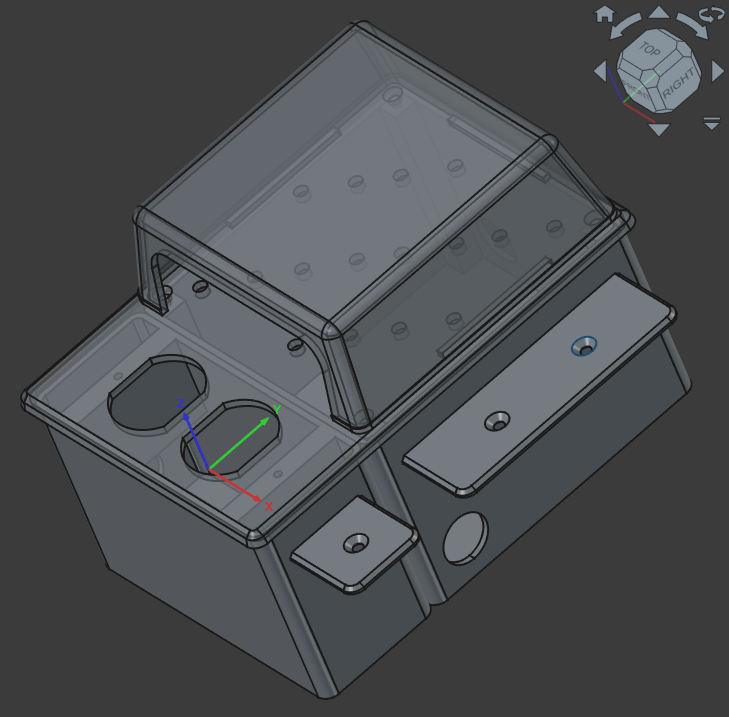

## Audo Box and Plate

We have a 7.2.2 sound system in the house to listen to music and watch movies.  
That means a lot of speakers all around us and a lot of wiring.  
We decided to put conduits in the walls and have all the wiring happening out of sight.  
In order to achieve this, I made sure all conduits come together in a central spot in the wall and I designed a custom box that I can embed in the wall just like electrical boxes to install power outlets.  As a matter of fact, I extended my custom audio box to also house a power outlet.  
So all conduits come into that box and I made a custom cover plate with a ton of holes to hold the audio wire connectors.  I decided to use banana style plugs for the audio connectors so that the audio system can easily get disconnected and pulled away when needed.  
The audio amplifier and TV are mounted on a rollable stand that we can move around in the living room and all the wiring, including power, is bundled together in an easy to handle flexible umbilican cord that all connects to this audio box.  

## The part:

