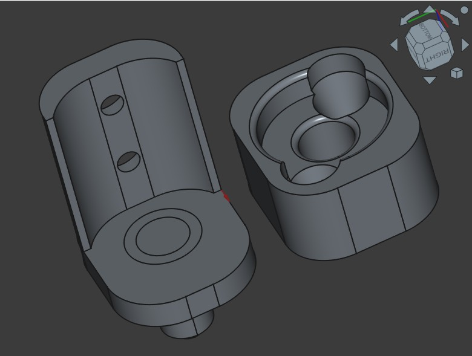
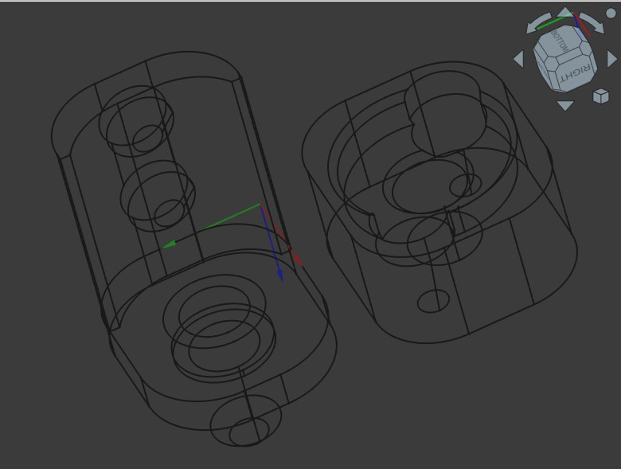

## Cowboy Door Bottom Pivot

We bought folding doors for our closet but we really wanted a cowboy style door with 2 individual sides that open and close independently.  I'm sure we could have found and bought cowboy doors online but that was going to increase price a lot and was going to take too long.  
So we bought a simple folding door and remodelled it into 2 separate parts and a custom door frame.  
The pieces missing were the pins on which the door sections pivot.  That's what I designed here...
 

## The part:

## Printed:

## Installed:

