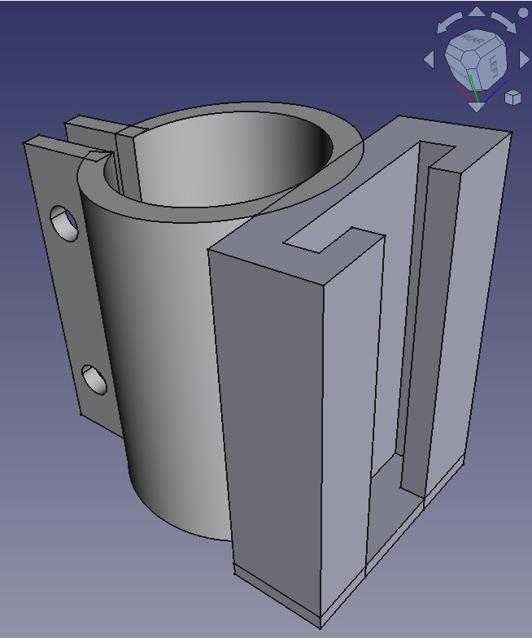
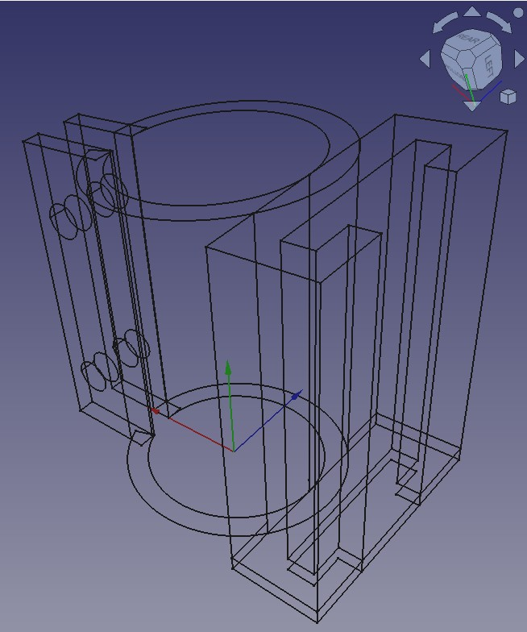
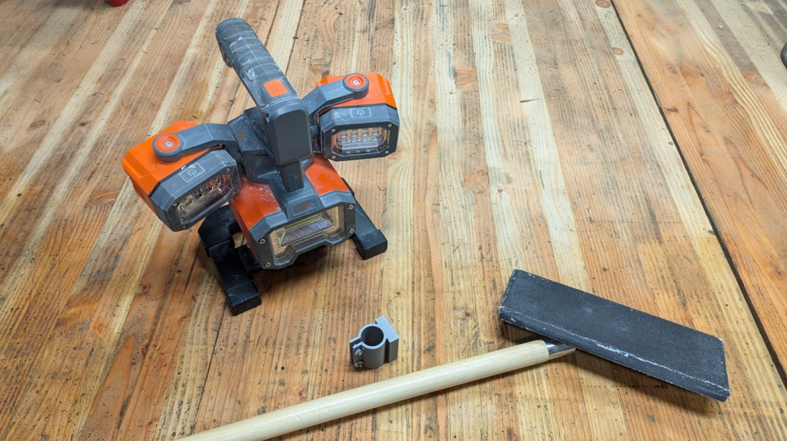
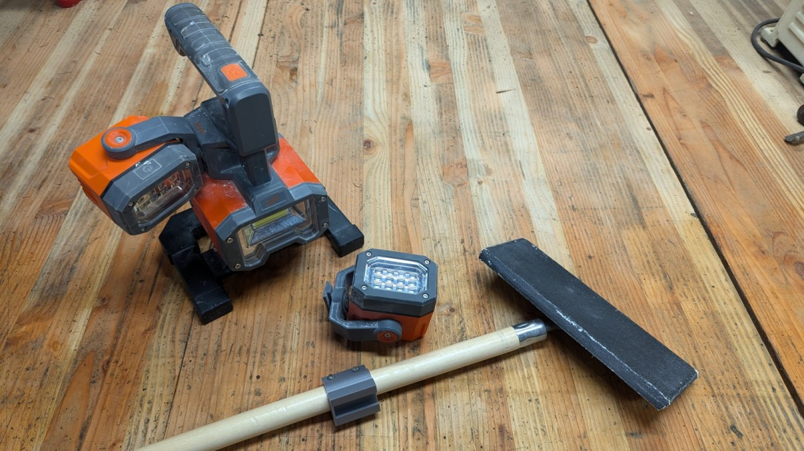
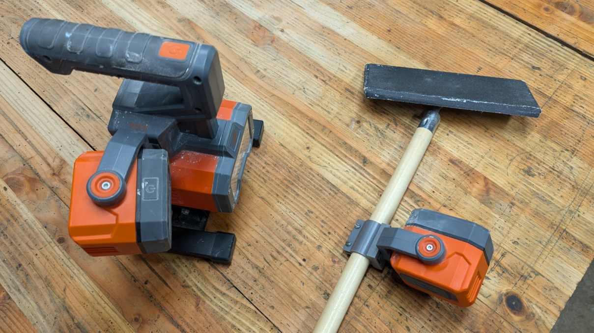
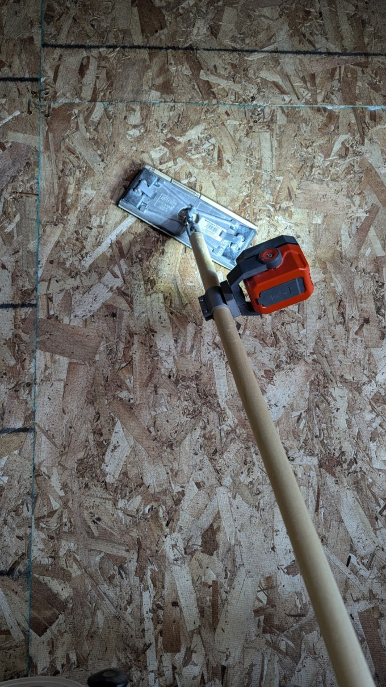

## Drywall Sanding Light Connector

Custom made connector to hold a light on a drywall sanding stick.  

 
 

## Installation:
 
 
 

## Use:
  

<video src="./documentation/DrywallSandingLight_use.mp4" type="video/mp4" width="540" height="960" controls></video>
