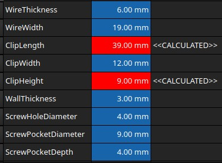
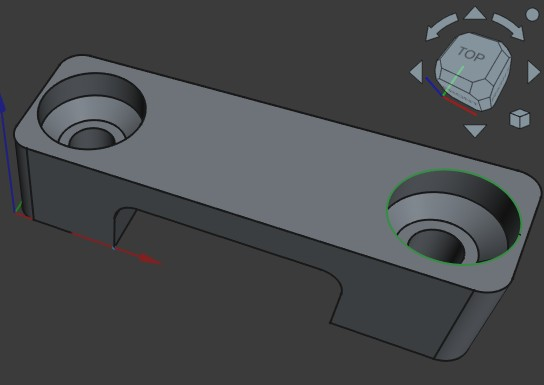

## Flat electric wire clips

I have 8/3, 10/3 and 12/3 gauge, flat UF-B (underground feeder and branch-circuit) electric wire running on my property to feed all kinds of electrical devices like mini-split heat pumps, bandsaw and woodmill.  Those wires run against walls here and there and need to get fastened.  I didn't find good, strong fasteners that were big and strong enough for these wires, so I decided to create my own parameterized fastener.  

## Measurements:
The design is configured through a spreadsheet that easily allows adjustments to make the model fit any size flat wire.  

### 10-3 UF-B wire:

## The connector:

