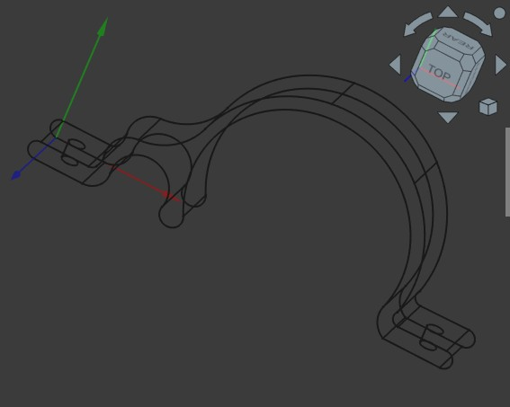

## Minisplit tube clip

I have a bunch of mini split heatpumps installed throughout the house.  I've hidden all feed lines inside the walls but there is one that has its lines running accross the wall, in plain sight.  This one is in my workshop and I'm perfectly fine having its feedlines running over the wall.  
I need a fastener to hold the lines and decided to fabricate a custom fastener.  

## The fastener:

