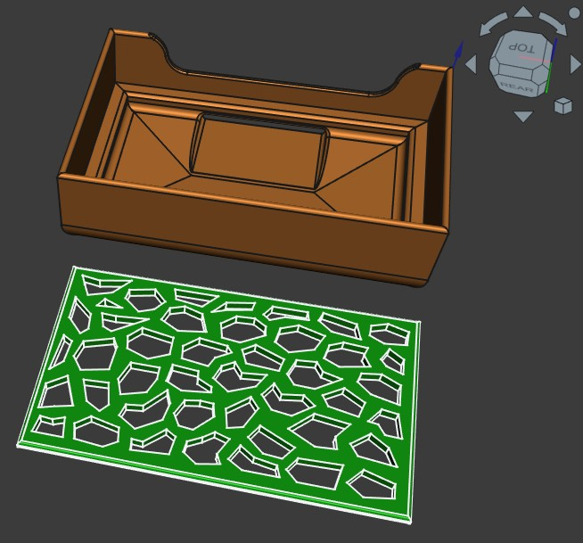

## Soap Box

Box to put a piece of solid soap in.  
The box is in 2 parts: the actual box and a removable tray to put the soap on.  
The tray has dripping holes and the box has a slit in the bottom for water to drain.  

## The box:
  
