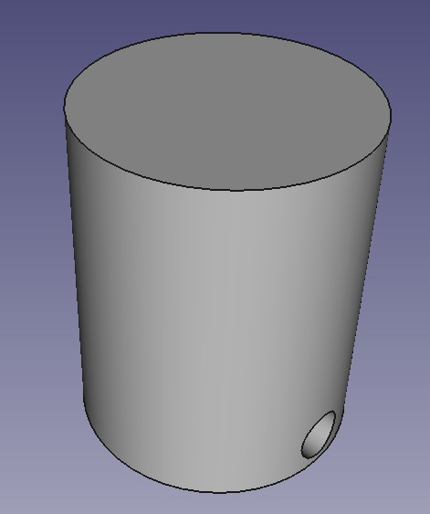
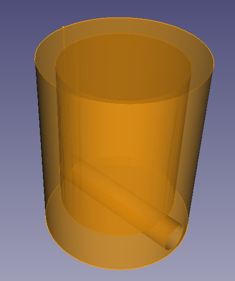

## StudFinder

Locate studs in the walls by finding the screws that are holding the drywall in place.  
Here we print simple holders with embedded magnets and a small hole in each holder to pass a wire through.  By adding a magnet at the top of the wire and another at the bottom, we can exactly see where the stud runs.  
The more magnets we add, the preciser the path of the stud is shown.  

 
  
