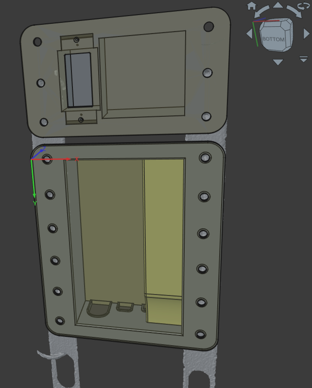
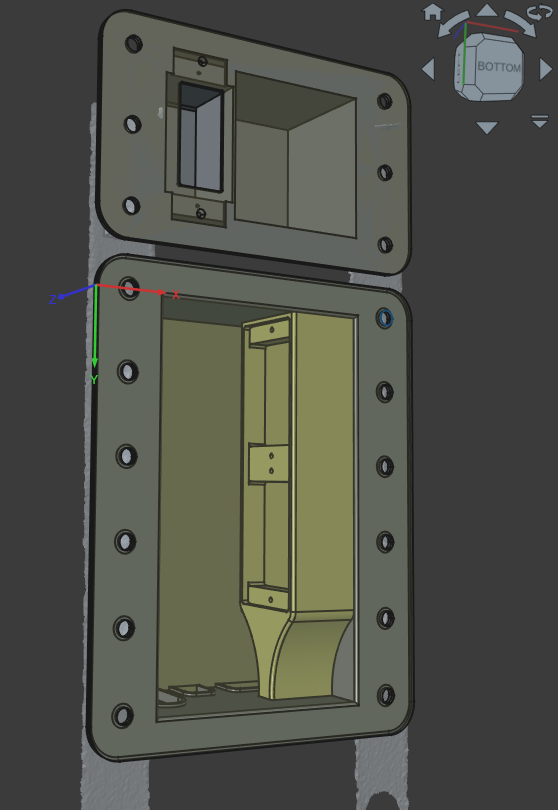

## TV-Stand Box (with cover plate and back lid)

We have a rolling metal TV stand at which the TV is mounted.  This stand also has one of the sub-woofers and the amplifier.  
It's a 7.2.2 sound system, which means there are shitton of wires going to this amplifier.  
There are all the wires for the speakers but there are also the power leads to power the TV, amplifier, woofer and there is an power adapters for USB to power a Chromecast.  
All these wires have been neatly bundled into a flexible conduit that connects to a custom developed "audio box" (see the Audio Plate project in this repository).  
This TV-stand box is where this flexible conduit originates from.  
All wires come into this box to hide everything as much as possible.  
Turns out both the Chromecast and amplifier sometimes lose network connectivity and the only way to restore connectivity is by disconnecting power to those devices.  The easiest way to achieve this, is by adding a power switch to the design.  This power switch is housed in a different box that sits higher up on the TV stand and cuts off power to all devices on the stand.  This switch can be a network connected switch that can be controlled remotely to shut down everything remotely.  

## The part:

