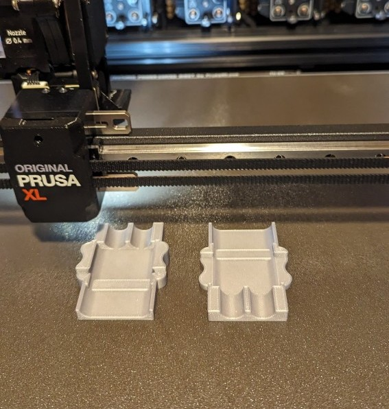
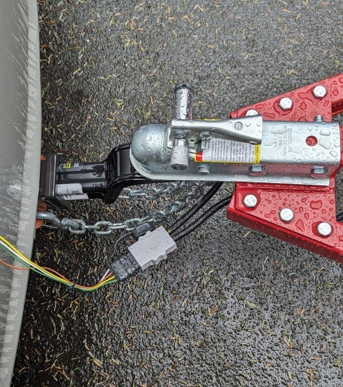
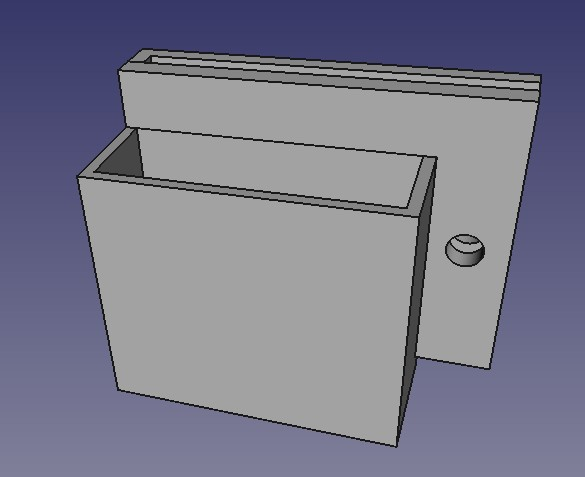
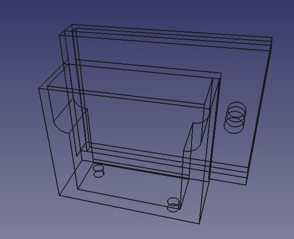

## Trailer Connector

Custom made cover for a standard 4-pin electrical connector for trailers.  
The main motivation to design this, was that the connector that came with the trailer had all its 7 wires exposed to the elements and I wanted to put them in conduits and shield it all better.  

See pictures below...  

## The connector:
 
  
  
  
  
  
  
  

## The connector holder:
 
 
 
 
